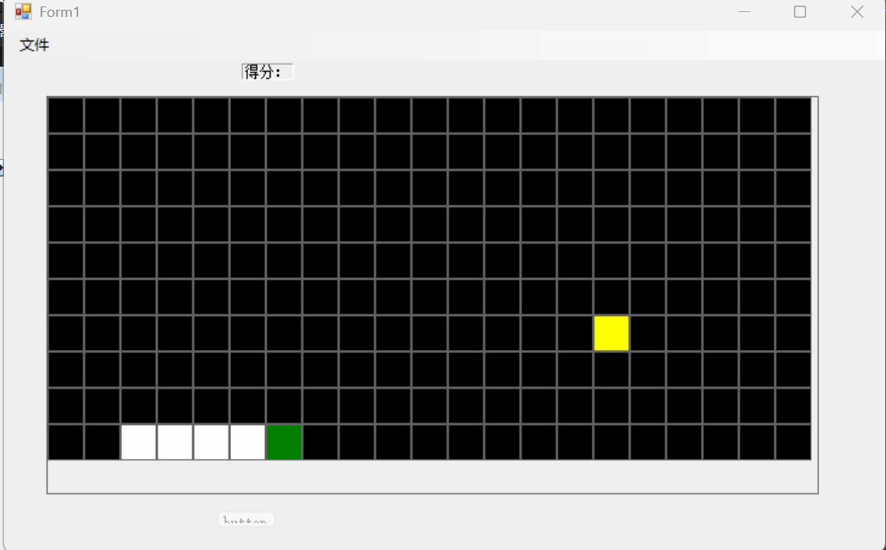
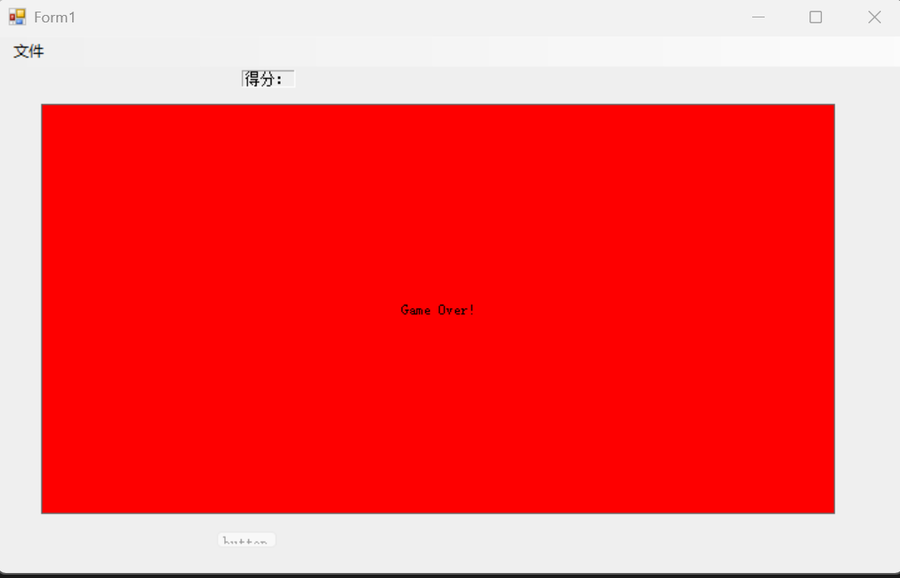

# 一个基于C#写的贪吃蛇

C#	winform	.net4.7.2







## 大概原理

```
吃蛇游戏
创建标签Label作为格子，定时改变标签颜色BackColor实现


1.创建一个面板，作为游戏的主界面
2.在面板上创建一个二维数组的标签，作为游戏的地图
3.创建一个列表，作为蛇的身体，列表中的每个元素都是一个标签
4.创建一个标签，作为蛇头
5.创建一个标签，作为食物
6.创建一个计时器，控制蛇的移动
7.创建一个计时器，控制食物的生成
8.创建一个枚举，表示蛇的移动方向
9.创建一个结构体，表示标签的坐标
10.创建一个方法，初始化游戏面板
11.创建一个方法，初始化蛇
12.创建一个方法，添加蛇的身体
13.创建一个方法，移除蛇的身体
14.创建一个方法，移动蛇(添头去尾实现)
15.创建一个方法，生成食物
16.创建一个方法，吃食物(添头但不去尾实现)
17.创建一个方法，游戏结束
18.在窗体加载事件中，初始化游戏面板和蛇，并启动计时器
19.在计时器事件中，移动蛇
20.在计时器事件中，如果没有食物，生成食物
21.在键盘事件中，改变蛇的移动方向
22.在键盘事件中，按空格键暂停或继续游戏
23.在菜单栏中，添加一个开始游戏的选项，点击后重新初始化游戏面板和蛇，并启动计时器
24.在游戏结束时，停止计时器，清空面板上的所有控件，显示一个标签，提示游戏结束
25.在吃食物的方法中，添加判断，如果蛇头的坐标和食物的坐标一样，就吃掉食物，增加蛇的长度，并生成新的食物
26.在移动蛇的方法中，添加判断，如果蛇头的坐标超出地图的边界，就游戏结束


注意，行是rows部分，列是cols部分，行是y轴，列是x轴
head也有tag是因为前面map赋值给了head
```

比较重要的是坐标结构体和tag的使用


## 说明

主要是控件以及基本的二维数组的使用，最难理解的反而是行row和列col?

行是从左到右一行，但是实际上是Y轴

列是从上往下一列，但是实际上是X轴


不完善，少数按钮没写实现方法

控制按键为上下左右

也没加自身碰撞检测

以后有时间可以改一下自定义大部分游戏设置，生成时间，蛇初始位置，